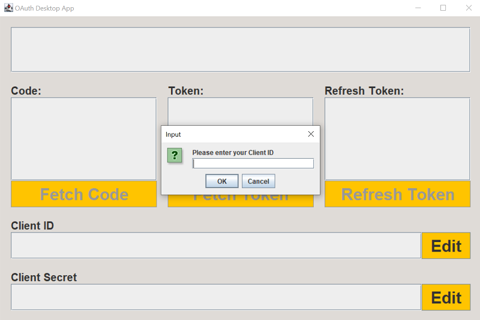

# OAuth 2.0 Example Desktop App

This project serves as an example of how to use OAuth 2.0 to authenticate with UPS from a desktop application.
Users can interact with a simple GUI to go through each of the following steps of the
Auth-Code flow in isolation:

1. Obtaining an authorization code
2. Exchanging a code for an authorization token and refresh token
3. Using a refresh token to obtain a new authorization/refresh token pair

## Getting Started

### Prerequisites
- You will need to have Maven and Java Development Kit 11 installed.

- You will need a valid **Client ID** and **Client Secret**.

If you have not yet obtained your OAuth credentials,
find out how at the [UPS Developer Portal](https://developer.ups.com/get-started).
You will also need to use the portal to specify an allowed Callback URL for this application.
Set this to the localhost URL on which the application server will be listening (see [Build and Run](#build-and-run)).
The URL must have the format `http://localhost:<PORT_NUMBER>`.

The app is built with Apache Maven 3.9.5, Spring Boot 2.7.9, and Java version 11.

### Download
- You can either download a local copy or clone the repository:

```
git clone https://github.com/UPS-API/java-ui-examples.git
```

## Build and Run

- Update `server.port` in `src/main/resources/application.properties` to match the port number of your Callback URL. This is set to 5001 by default.

- From the OAuth_AuthCode_DesktopApp directory, build the project with Maven and run the generated JAR file:

```
mvn clean install
```
```
java -jar target/oauthdemo-0.0.1.jar
```

- Or to run using Spring Boot:

```
mvn spring-boot:run
```

Once the server boots, the GUI will open as a window on your desktop.



## More information

For more information on using OAuth 2.0, see our supplemental documents here:
- <https://developer.ups.com/oauth-developer-guide>
- <https://developer.ups.com/api/reference/oauth/authorization-code>
